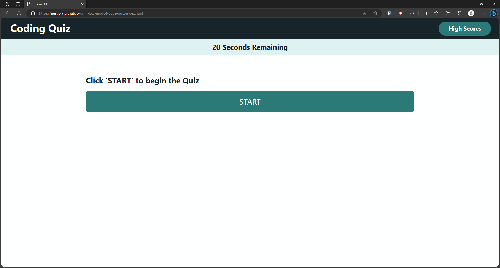
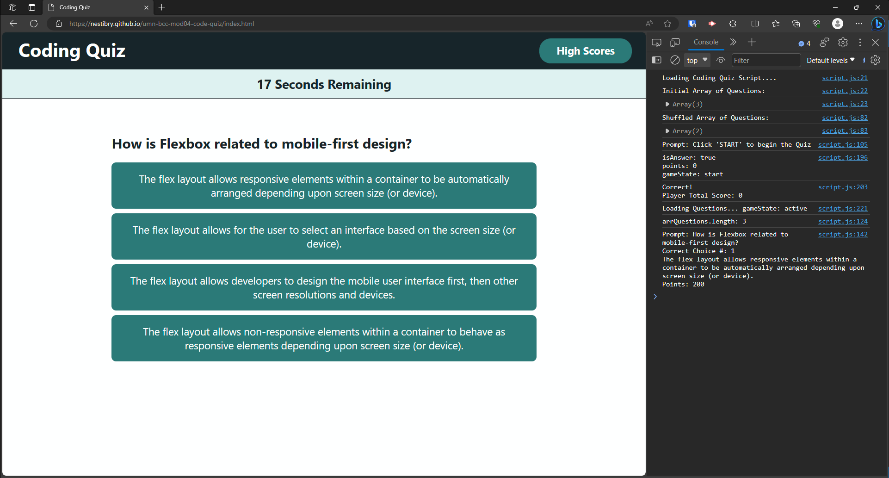
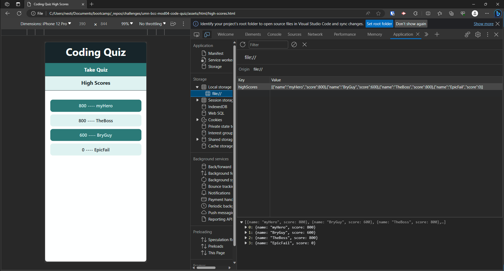

# Module 4 Challenge - Code Quiz
*University of Minnesota - Coding Boot Camp*

## Description
Developed a timed multiple-choice coding assessment to simulate a coding assessment as part of an interview process.
- The app features a responsive user interfact (dynamically updating the HTML/CSS styling and powered by JavaScript code). 
- User scores points for answering the question correctly
- User loses time for answering the question incorrectly
- Use submits scores that are stored in local Storage to be compared to previous quiz trials

## Installation

N/A

## Usage

Deployed Site: https://nestibry.github.io/umn-bcc-mod04-code-quiz/

Coding Quiz Page: 
- HTML: index.html
- Styling: ./assets/css/style.css
- JavaScript: ./assets/js/script.js
- Quiz Questions: ./assets/js/data.js

High Scores Page:
- HTML: ./assets/html/high-scores.html
- Styling: ./assets/css/style.css
- JavaScript: ./assets/js/high-scores.js

Figure: Default Screen

Figure: Prompt Example

 
Figure: High Scores Example

## Credits
[How To Randomly Shuffle a JavaScript Array - Durstenfeld Shuffle](https://stackoverflow.com/questions/2450954/how-to-randomize-shuffle-a-javascript-array) -  (Source Stack Overflow - See post by Laurens Holst and edited by ashleedawg)

© 2023 edX Boot Camps LLC. (and for the coding quiz questions)

## License

[MIT License](https://choosealicense.com/licenses/mit/)

